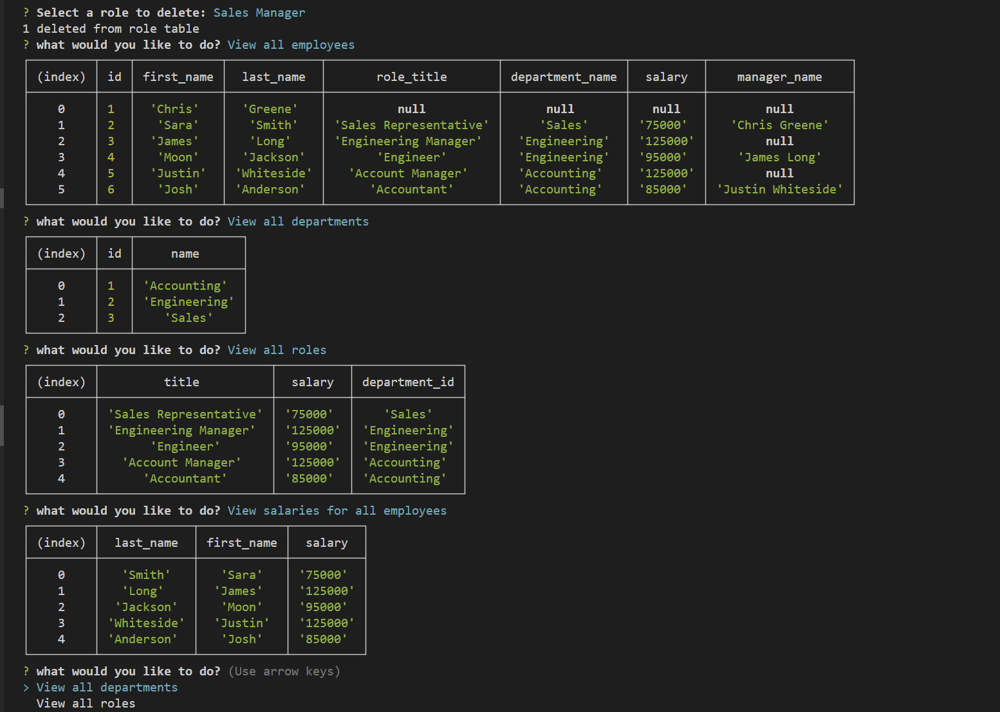

# SQL Employee Tracker

## Description

The application in a Content Management system that allows the user to manage a companies roles, departments, and employees. It does this by using MySql and Inquirer. The commands specific functionality available to the user is the ability to view all departments, view all roles, view all employees, view employees by department, view employees by manager, view all salaries, view salary for a specific employee, add an employee, add a department, update a manager, and delete a department, role, or employee. These commands are carried out using inquirer and the results are displayed in the terminal using tables. 

- My motivation for creating this application is two fold, first to gain practical experience using MySql and interacting table created using MySql through the command line via Inquirer. The second reason is to generate a way for a company to store, access and interact with information regarding the departments present, employees on staff, and the specific roles with in the company. 

- I built this project because every company needs a database containing information about there day to day operations and they need to be able to interact with the table storing the information.

- It solves a common problem all companies have of storing relevant information about the infrastructure of the company in a centralized location and being able to create, read, update and delete information in this central location. 

- What I learned is how to create tables in a database using MySql, how to read from these table and display the output in the terminal, how to create, update, and delete information in these tables using commands generated by inquire and carrying a MySql payload to be executed upon selection.

## Usage

The application can be downloaded via GitHub from this link.

https://github.com/chigreene/SQL-Employee-Tracker

The application is started by executing 'npm run start' in the terminal. Using the arrow keys the user can then select the prompt they would like to run. 

Some prompts require additional selections to run, these are also selected using the arrow keys. 

To exit the application the user can select exit. 

Once a user selects all require field a table is generated and output to the terminal.

Below is a view walking through the features of the application

https://drive.google.com/file/d/1YpXwiDFG0Fs1pzlvGy2dysYW5WOuclhC/view

## Credits
Meg Myers, Ross, Addison, EdX, ChatGPT, Traversy Media